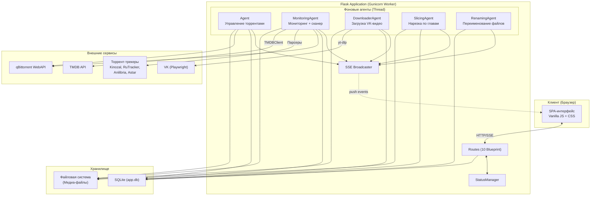
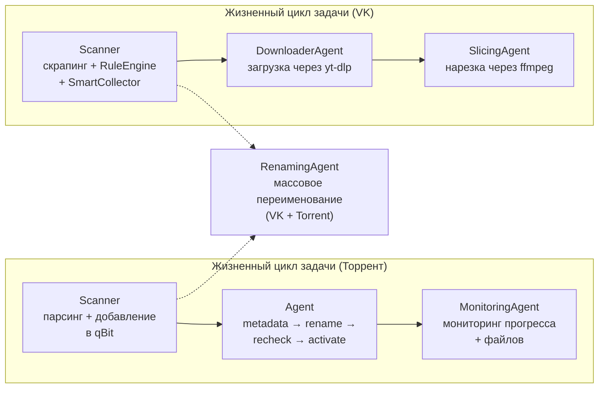
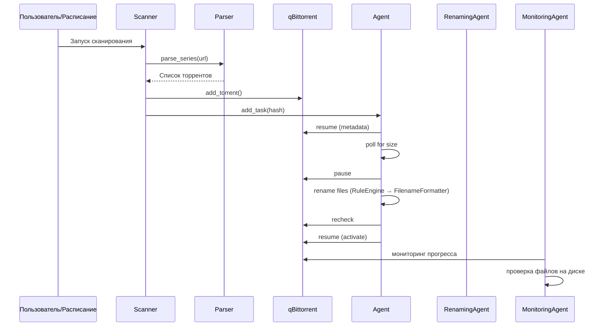
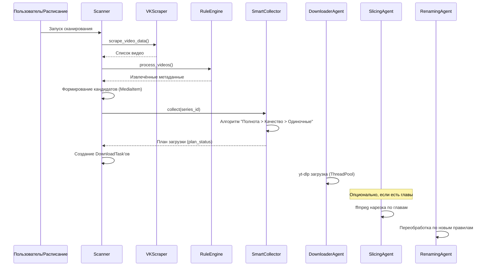
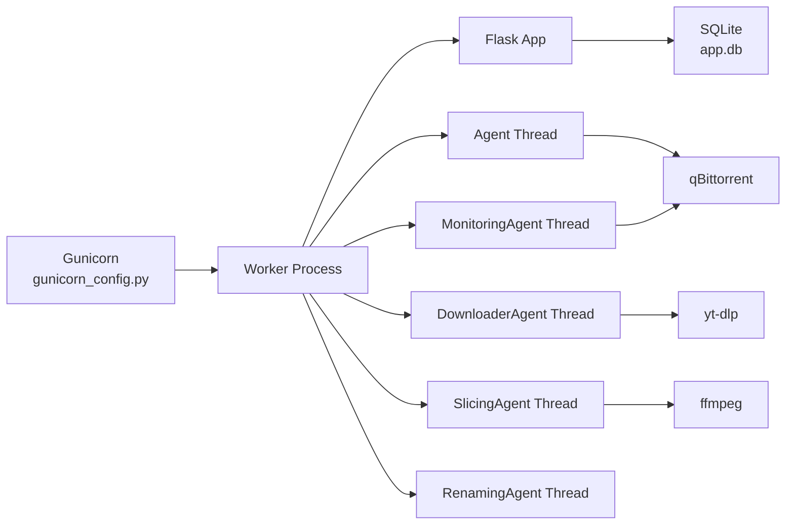

# Архитектура проекта Series Tracker

## Обзор

**Series Tracker** — это self-hosted веб-приложение на Flask для автоматического отслеживания, загрузки и организации сериалов из торрент-трекеров и VK. Приложение работает через Gunicorn с фоновыми агентами-потоками и использует SQLite для хранения данных.



---

## Стек технологий

| Компонент | Технология |
|-----------|-----------|
| Бэкенд | **Python 3**, Flask 3.0, Gunicorn |
| БД | **SQLite** через SQLAlchemy 2.0 ORM |
| Фронтенд | **Vanilla JS** (SPA), CSS (без фреймворков) |
| Парсинг | BeautifulSoup4, lxml, cloudscraper |
| Скрапинг VK | **Playwright** (headless browser) |
| Загрузка видео | **yt-dlp** (subprocess) |
| Нарезка видео | **ffmpeg** (subprocess) |
| Торрент-клиент | **qBittorrent** WebAPI |
| Real-time | **Server-Sent Events (SSE)** |
| Метаданные | **TMDB API** |

---

## Файловая структура проекта

```
series-tracker/
├── run.py                   # Точка входа: Flask app + инициализация агентов
├── models.py                # SQLAlchemy-модели (17 таблиц)
├── db.py                    # Database: все CRUD-операции (95KB)
├── auth.py                  # AuthManager: сессии Kinozal, RuTracker, qBittorrent
├── scanner.py               # perform_series_scan(): основная логика сканирования
├── smart_collector.py        # SmartCollector: алгоритм планирования загрузок
├── rule_engine.py           # RuleEngine: обработка правил парсера
├── filename_formatter.py    # FilenameFormatter: формирование имён файлов
├── status_manager.py        # StatusManager: агрегация и трансляция статусов
├── qbittorrent.py           # QBittorrentClient: обёртка qBit WebAPI
├── downloader.py            # Downloader: загрузка через yt-dlp
├── sse.py                   # ServerSentEvent: real-time уведомления
├── logger.py                # Logger: логирование в БД
├── debug_manager.py         # DebugManager: granular debug flags
├── file_cache.py            # Кэширование файлов
├── gunicorn_config.py       # Конфигурация Gunicorn
│
├── agents/                  # Фоновые агенты (daemon threads)
│   ├── agent.py             # Agent: жизненный цикл торрентов в qBit
│   ├── monitoring_agent.py  # MonitoringAgent: авто-сканирование + мониторинг файлов
│   ├── downloader_agent.py  # DownloaderAgent: пул загрузок VK-видео
│   ├── slicing_agent.py     # SlicingAgent: нарезка видео через ffmpeg
│   └── renaming_agent.py    # RenamingAgent: массовое переименование файлов
│
├── routes/                  # Flask Blueprints (API-маршруты)
│   ├── __init__.py          # init_all_routes() — регистрация 10 чертежей
│   ├── series.py            # CRUD сериалов, действия, сканирование
│   ├── media.py             # Медиа-элементы, задачи загрузки/нарезки
│   ├── settings.py          # Настройки приложения
│   ├── system.py            # SSE-поток, логи, БД, агенты
│   ├── parser.py            # Профили и правила парсера
│   ├── trackers.py          # Управление трекерами
│   ├── tmdb.py              # Поиск/привязка TMDB
│   ├── filebrowser.py       # Файловый браузер для выбора директорий
│   └── test.py              # Тестовые эндпоинты
│
├── parsers/                 # Парсеры торрент-трекеров
│   ├── kinozal_parser.py    # Kinozal.tv
│   ├── rutracker_parser.py  # RuTracker
│   ├── anilibria_parser.py  # Anilibria (API)
│   ├── anilibria_tv_parser.py # Anilibria.tv
│   └── astar_parser.py      # Astar (фиксированные серии)
│
├── scrapers/
│   └── vk_scraper.py        # VK: скрапинг видео через Playwright
│
├── logic/                   # Бизнес-логика (вынесенная)
│   ├── metadata_processor.py # build_final_metadata()
│   ├── renaming_processor.py # process_and_rename_torrent_files()
│   └── task_creator.py       # Создание задач на переименование
│
├── utils/                   # Утилиты
│   ├── tmdb_client.py       # TMDBClient
│   ├── tracker_resolver.py  # Определение трекера по URL
│   ├── chapter_parser.py    # Парсинг глав из видео
│   ├── chapter_filter.py    # Фильтрация мусорных глав
│   └── path_finder.py       # Поиск исполняемых файлов (ffmpeg, yt-dlp)
│
├── static/                  # Фронтенд
│   ├── js/
│   │   ├── app.js           # Главный модуль SPA
│   │   └── components/      # 21 JS-компонент (модальные окна, вкладки, настройки)
│   └── css/
│       ├── base/            # variables.css, layout.css
│       ├── components/      # 11 CSS-файлов (card, modal, table, rule-editor...)
│       └── utils/           # animations.css
│
├── templates/
│   └── index.html           # Точка входа SPA
│
└── docs/                    # Документация
```

---

## Модель данных (SQLAlchemy)

```mermaid
erDiagram
    Series ||--o| SeriesStatus : "1:1 статусы"
    Series ||--o| SeriesTMDB : "1:1 TMDB"
    Series ||--o{ Torrent : "торренты"
    Series ||--o{ MediaItem : "VK-медиа"
    Series ||--o{ SlicedFile : "нарезанные"
    Torrent ||--o{ TorrentFile : "файлы"
    ParserProfile ||--o{ ParserRule : "правила"
    ParserRule ||--o{ ParserRuleCondition : "условия"

    Series {
        int id PK
        text url
        text name
        text name_en
        text site
        text save_path
        text season
        text quality
        text state
        text source_type
        int parser_profile_id FK
        bool auto_scan_enabled
    }

    SeriesStatus {
        int series_id PK_FK
        bool is_waiting
        bool is_scanning
        bool is_downloading
        bool is_ready
        bool is_error
        datetime is_viewing
    }

    Torrent {
        int id PK
        int series_id FK
        text torrent_id
        text link
        text qb_hash
        bool is_active
    }

    TorrentFile {
        int id PK
        int torrent_db_id FK
        text original_path
        text renamed_path
        text status
    }

    MediaItem {
        int id PK
        int series_id FK
        text unique_id UK
        int episode_start
        int episode_end
        text plan_status
        text status
        text source_url
        text final_filename
        text chapters
        text slicing_status
    }

    SlicedFile {
        int id PK
        int series_id FK
        text source_media_item_unique_id
        int episode_number
        text file_path
    }

    SeriesTMDB {
        int series_id PK_FK
        int tmdb_id
        int tmdb_season_number
        int total_episodes
    }

    ParserProfile {
        int id PK
        text name UK
        text preferred_voiceovers
    }

    ParserRule {
        int id PK
        int profile_id FK
        text name
        int priority
        text action_pattern
    }
```

### Полный список таблиц

| # | Таблица | Назначение |
|---|---------|-----------|
| 1 | `series` | Отслеживаемые сериалы |
| 2 | `series_statuses` | Флаги состояний сериала (1:1) |
| 3 | `series_tmdb_mappings` | Привязка к TMDB (1:1) |
| 4 | `torrents` | Загруженные торренты |
| 5 | `torrent_files` | Файлы внутри торрентов |
| 6 | `media_items` | VK-видео кандидаты для загрузки |
| 7 | `download_tasks` | Очередь загрузок (VK + торренты) |
| 8 | `slicing_tasks` | Задачи на нарезку видео |
| 9 | `sliced_files` | Результаты нарезки |
| 10 | `agent_tasks` | Задачи основного агента (торренты в qBit) |
| 11 | `scan_tasks` | Состояние сканирования (для recovery) |
| 12 | `renaming_tasks` | Задачи на переименование файлов |
| 13 | `relocation_tasks` | Задачи на перемещение сериала |
| 14 | `parser_profiles` | Профили правил парсера |
| 15 | `parser_rules` | Правила парсера |
| 16 | `parser_rule_conditions` | Условия правил |
| 17 | `settings` | Настройки приложения (key-value) |
| 18 | `auth` | Учётные данные сервисов |
| 19 | `logs` | Журнал событий |
| 20 | `trackers` | Реестр трекеров и зеркал |

---

## Система агентов

Все агенты наследуются от `threading.Thread` и работают как **daemon-потоки** внутри Worker-процесса Gunicorn. Запуск происходит через хук `post_fork` в [run.py](file:///home/user/series-tracker/run.py).



### Agent (Основной агент)

**Файл**: [agent.py](file:///home/user/series-tracker/agents/agent.py)
**Роль**: Управление жизненным циклом торрентов в qBittorrent

Стадии задачи: `awaiting_metadata` → `polling_for_size` → `awaiting_pause_before_rename` → `renaming` → `rechecking` → `activating` ✓

- Использует **long-polling** через `sync_main_data()` qBittorrent
- Восстанавливает незавершённые задачи из БД при старте
- Инициирует переименование файлов через `process_and_rename_torrent_files()`

### MonitoringAgent

**Файл**: [monitoring_agent.py](file:///home/user/series-tracker/agents/monitoring_agent.py)
**Роль**: Планировщик сканирования + мониторинг файловой системы

- **Авто-сканирование** по расписанию (настраиваемый интервал)
- **Проверка файлов**: обнаружение пропавших файлов, «усыновление» существующих
- **Перемещение сериалов**: обработка задач `RelocationTask`
- **Синхронизация статусов**: `sync_torrent_statuses()`, `sync_vk_statuses()`

### DownloaderAgent

**Файл**: [downloader_agent.py](file:///home/user/series-tracker/agents/downloader_agent.py)
**Роль**: Параллельная загрузка VK-видео

- Использует `ThreadPoolExecutor` с настраиваемым лимитом
- Загрузка через `yt-dlp` (subprocess) с отслеживанием прогресса
- Троттлинг обновлений БД (каждые 2 секунды)

### SlicingAgent

**Файл**: [slicing_agent.py](file:///home/user/series-tracker/agents/slicing_agent.py)
**Роль**: Нарезка видео по главам

- Использует `ffmpeg` (subprocess) для lossless нарезки (`-c copy`)
- Работает с отфильтрованными главами (фильтрация мусорных глав)
- Поддерживает восстановление прогресса (resume)

### RenamingAgent

**Файл**: [renaming_agent.py](file:///home/user/series-tracker/agents/renaming_agent.py)
**Роль**: Массовое переименование файлов

- **Event-driven**: «просыпается» только по сигналу `trigger()`
- Типы задач: `mass_torrent_reprocess`, `mass_vk_reprocess`
- Перепрогоняет правила через `RuleEngine` → `FilenameFormatter`

---

## Конвейер обработки (Pipelines)

### Торрент-конвейер



### VK-конвейер



---

## Система правил (RuleEngine)

**Файл**: [rule_engine.py](file:///home/user/series-tracker/rule_engine.py)

Визуальный конструктор правил на фронтенде создаёт JSON-паттерны из «блоков»:

| Тип блока | Описание |
|-----------|----------|
| `text` | Фиксированный текст (экранируется) |
| `number` | Группа захвата `(\d+)` |
| `whitespace` | `\s+` |
| `any_text` | `.*?` |
| `start_of_line` / `end_of_line` | `^` / `$` |
| `add` / `subtract` | Арифметическая операция над захваченным числом |

**Типы действий**: `extract_single`, `extract_range`, `extract_season`, `assign_voiceover`, `assign_episode`, `assign_season`, `assign_quality`, `exclude`

Правила сгруппированы в **профили** и применяются с учётом приоритетов и флага `continue_after_match`.

---

## SmartCollector — Алгоритм планирования

**Файл**: [smart_collector.py](file:///home/user/series-tracker/smart_collector.py)
**Версия алгоритма**: v4.1 «Полнота > Качество > Одиночные»

Алгоритм решает задачу **оптимального покрытия** набора эпизодов:

1. **Базовый план** — для каждого эпизода выбирается лучший одиночный файл по приоритету качества
2. **Закрытие дыр** — итеративный подбор компиляций для покрытия отсутствующих эпизодов (не доминируемых)
3. **Апгрейд качества** — замена одиночных файлов компиляциями более высокого качества
4. **Финализация** — назначение `plan_status`: `in_plan_single`, `in_plan_compilation`, `replaced`, `redundant`

---

## Система статусов

**Файл**: [status_manager.py](file:///home/user/series-tracker/status_manager.py)

Каждый сериал имеет набор **булевых флагов** в таблице `series_statuses`:

```
is_error → is_scanning → is_checking → is_slicing → is_renaming → 
is_metadata → is_activating → is_downloading → is_ready → is_viewing → is_waiting
```

**Иерархия приоритетов**: `error` > `scanning` > `checking` > `slicing` > `renaming` > `metadata` > `activating` > `downloading` > `ready` > `viewing` > `waiting`

`StatusManager` агрегирует флаги в строку `state` (например, `"downloading, ready"`) и транслирует через SSE.

---

## Real-time обновления (SSE)

**Файл**: [sse.py](file:///home/user/series-tracker/sse.py)

`ServerSentEvent` — синглтон pub/sub:

| Тип события | Источник | Данные |
|-------------|---------|--------|
| `series_updated` | StatusManager | Полные данные сериала |
| `agent_queue_update` | Agent | Очередь задач агента |
| `download_queue_update` | DownloaderAgent | Прогресс загрузок |
| `slicing_queue_update` | SlicingAgent | Прогресс нарезки |
| `scanner_status_update` | MonitoringAgent | Статус сканера |
| `agent_heartbeat` | Все агенты | Heartbeat |
| `relocation_started/finished` | MonitoringAgent | Перемещение сериала |
| `renaming_complete` | RenamingAgent | Завершение переименования |

---

## Авторизация

**Файл**: [auth.py](file:///home/user/series-tracker/auth.py)

| Сервис | Метод | Кэширование |
|--------|-------|-------------|
| **Kinozal** | POST + cookies | Кэш сессий по домену (зеркала) |
| **RuTracker** | POST + форма | Кэш сессий по домену |
| **qBittorrent** | POST → SID cookie | SID в Settings |
| **CloudScraper** | cloudscraper | Ленивая инициализация |

Поддержка повторных попыток (до 5 с задержкой 5 сек) для Kinozal и RuTracker.

---

## Фронтенд (SPA)

Одностраничное приложение без фреймворков на **vanilla JavaScript**.

### Основные компоненты (21 файл)

| Компонент | Назначение |
|-----------|-----------|
| `app.js` | Главный модуль, роутинг, SSE-подписка |
| `addSeriesModal.js` | Добавление сериала с выбором трекера |
| `statusModal.js` | Просмотр статуса сериала |
| `StatusTabProperties.js` | Вкладка свойств + TMDB + формат имени |
| `StatusTabHistory.js` | Вкладка истории |
| `StatusTabTorrentComposition.js` | Состав торрента (файлы + переименования) |
| `seriesCompositionManager.js` | VK: управление медиа-элементами |
| `ChapterManager.js` | Управление главами и нарезкой |
| `settingsModal.js` | Контейнер настроек (вкладки) |
| `settingsAuth.js` | Учётные данные сервисов |
| `settingsAgents.js` | Статус и управление агентами |
| `settingsParser.js` | Конструктор правил парсера (блоки) |
| `settingsTrackers.js` | Управление трекерами |
| `settingsDebug.js` | Отладочные инструменты |
| `settingsLogging.js` | Настройки логирования |
| `DirectoryPicker.js` | Файловый браузер для выбора путей |
| `ConstructorComponents.js` | Компоненты визуального конструктора |
| `DatabaseViewerModal.js` | Просмотр таблиц БД |
| `logsModal.js` / `logsViewerTab.js` | Просмотр логов |
| `confirmationModal.js` | Модальное подтверждение |
| `FileTree.js` | Дерево файлов |

### CSS-архитектура

```
static/css/
├── base/
│   ├── variables.css    # CSS-переменные (цвета, отступы, шрифты)
│   └── layout.css       # Глобальная раскладка
├── components/          # 11 компонентных стилей
│   ├── card.css, compact-card.css    # Карточки сериалов
│   ├── modal.css                     # Модальные окна
│   ├── table.css                     # Таблицы
│   ├── forms.css, buttons.css        # Формы и кнопки
│   ├── lists.css                     # Списки
│   ├── constructor.css               # Конструктор правил
│   ├── rule-editor.css               # Редактор правил
│   ├── chapter-filter.css            # Фильтр глав
│   └── responsive.css                # Адаптивность
└── utils/
    └── animations.css   # CSS-анимации
```

---

## Развёртывание



- **Сервер**: Gunicorn с хуком `post_fork` для запуска агентов в worker-процессе
- **Graceful shutdown**: обработка SIGTERM/SIGINT/SIGQUIT → остановка всех агентов с таймаутом 11 сек
- **Recovery**: все агенты восстанавливают незавершённые задачи из БД при старте

---

## Зависимости (requirements.txt)

```
beautifulsoup4==4.12.3    # HTML-парсинг
cloudscraper==1.2.71      # Обход Cloudflare
Flask==3.0.3              # Веб-фреймворк
Flask-Cors==5.0.0         # CORS
lxml==6.0.0               # XML/HTML парсер
playwright==1.52.0        # Headless browser (VK)
requests==2.32.3          # HTTP-клиент
SQLAlchemy==2.0.35        # ORM
gunicorn==22.0.0          # WSGI-сервер
```

**Системные зависимости** (ожидаются в PATH): `ffmpeg`, `yt-dlp`
