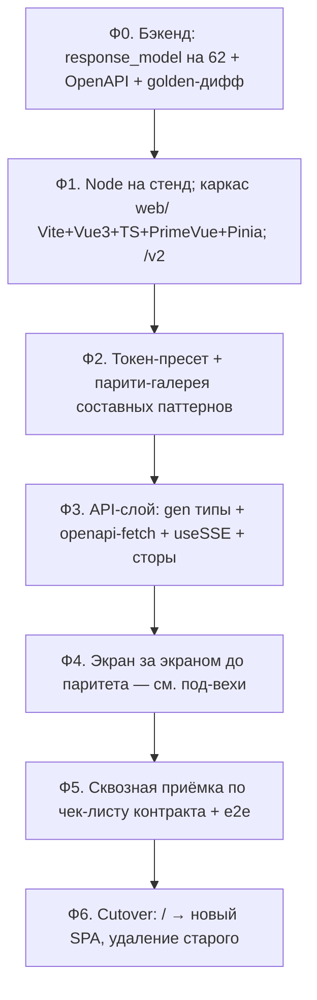

# ТЗ и план: переписывание фронтенда series-tracker

> Статус: **черновик v2 на согласование** (2026-06-17). Учтена независимая
> критическая рецензия (см. §16). Документ фиксирует цель, стек,
> констрейнты, архитектуру состояния, карту элементов, типизацию API,
> план по фазам и правила переезда на Vite + Vue 3 SFC + TypeScript +
> PrimeVue. Источник нюансов — разведка по коду (app.js, 22 компонента,
> 14 CSS, contracts/*) + рецензия. Связанные: [contracts/endpoints.md](../contracts/endpoints.md),
> [contracts/sse_contract.md](../contracts/sse_contract.md), [CLAUDE.md](../CLAUDE.md).

---

## 1. Журнал решений (согласовано с пользователем)

| # | Вопрос | Решение |
|---|---|---|
| Р-Ф1 | Сборка/архитектура | **Vite + Vue 3 SFC + TypeScript** |
| Р-Ф2 | UI-библиотека | **PrimeVue 4** (производный пресет на базе `Aura`) |
| Р-Ф3 | Bootstrap | **Убрать полностью** (оболочки и сетку/утилиты) |
| Р-Ф4 | Оболочки (модалки/табы/тосты/таблицы/дерево) | **PrimeVue** (Dialog/Tabs/Toast/DataTable/Tree) |
| Р-Ф5 | Раскладка вместо Bootstrap | **Обычный CSS** (Flexbox/Grid) + токены |
| Р-Ф6 | Типизация API | **Все 62 маршрута** (`response_model`) + включить OpenAPI, **обязательно с safeguards** (§9): `extra="allow"`, golden-дифф, `responses={}` на коды ошибок |
| Р-Ф7 | Стратегия переезда | **Параллельный `/v2`, полная переделка целиком**, переключение по полному паритету. НЕ инкрементально в прод |
| Р-Ф8 | Точность дизайна | **«Близко»**, приёмка покомпонентно в парити-галерее |
| Р-Ф9 | Кастом-островки | Карточка сериала и конфигуратор правил — **кастом** на общих токенах |
| Р-Ф10 | Управление состоянием | **Pinia** (§11), с явной merge-логикой дельт |
| Р-Ф11 | Сборка фронта | **Поставить Node 20 на стенд**, сборка `web/dist` при деплое; `dist` вне git |
| Р-Ф12 | Порядок работ внутри `/v2` | **Внутренние срезы паритета** (галерея → API-слой → экран end-to-end), чтобы дефекты всплывали рано. Это не меняет Р-Ф7 |

> **Обратная связь пользователя:** никаких плавных переездов кусками в
> прод и срезания углов. Реализация — цельная, читаемая, доводится до
> полного паритета в `/v2`, и только потом переключается.

---

## 2. Цель и не-цели

**Цель.** Убрать «солянку» (CDN-Vue + инлайн-шаблоны-строки + Bootstrap +
слабая компонентизация), переписав фронт на собираемый стек с реальными
компонентами, типами и типизированным API-слоем.

**Не-цели (НЕ меняем):** визуал/UX (целимся «близко»); контракт (62 HTTP
+ 11 SSE, §8); поведение бэкенда (правки только additive, §9); законы
series-tracker (шина/БД/модули фронтом не затрагиваются).

---

## 3. Целевой стек (версии фиксируем по track-muxer)

| Слой | Технология | Версия-ориентир |
|---|---|---|
| Среда сборки | Node.js | **20 LTS** (ставим на стенд) |
| Сборка | Vite | **^6** |
| Фреймворк | Vue 3 SFC + `<script setup>` | **^3.5** |
| Язык | TypeScript (strict) | **^5.7** |
| UI | PrimeVue + primeicons | **^4.2** |
| Тема | пресет на базе `Aura` (`@primevue/themes`) | — |
| Состояние | **Pinia** | **^2** |
| Раскладка | обычный CSS (Flexbox/Grid) + CSS-переменные | — |
| API-клиент | openapi-fetch + openapi-typescript | — |
| SSE | нативный `EventSource` в `useSSE` | — |
| Drag-n-drop | vuedraggable | **^4** |
| Роутинг | **не нужен на старте** (одно представление + диалоги); ввести минимально, если потребуется deep-link | — |

---

## 4. Жёсткие констрейнты

1. **Контракт нерушим** — 62 HTTP + 11 SSE (§8). Инварианты: `hash` в
   очередях (находка 39); `is_busy` в каждом `series_updated` (находка
   38); `agent_heartbeat` не воскрешать (Р-18); **`series_updated` —
   дельта, применяется частичным merge, а не заменой объекта**;
   **закрытие статус-модалки обязано слать `viewing`-stop** (Р-11),
   иначе серверный эфемерный `viewing` зависнет; **ровно одно
   SSE-соединение на вкладку**.
2. **Бэкенд — только additive** (§9): форма ответов не меняется,
   доказывается golden-диффом.
3. **Один источник токенов** (§7) — задача, а не данность.
4. **Дизайн утверждается в парити-галерее** покомпонентно, на составных
   паттернах (не только базовые поля/кнопки).
5. **Полнота, без срезания углов** — все экраны и точки контракта
   переносятся; ведётся чек-лист паритета; заглушки запрещены.
6. **`/v2` изолирован** — старый фронт не трогаем до cutover.
7. **Дисциплина** — русский; без AI-атрибуции; коммит на каждый
   согласованный шаг; TypeScript strict.

---

## 5. Карта элементов: тип UI → PrimeVue или кастом

| Тип элемента | Где сейчас | Целевое решение |
|---|---|---|
| Текстовое/числовое/пароль | формы | InputText / InputNumber / Password |
| Select/выпадающий | ConstructorItemSelect | **Select** |
| Checkbox/Switch | настройки, формы | ToggleSwitch / Checkbox |
| Radio (btn-group) | vk_search_mode | **SelectButton** |
| Кнопка | везде | Button |
| Модалка (6 шт) | Bootstrap modal | **Dialog** |
| Табы / аккордеон | status/settings/logs | Tabs / Accordion |
| Таблица | div-table + Bootstrap table | DataTable + Column |
| Прогресс/спиннер | очереди/модалки | ProgressBar / ProgressSpinner |
| Тост / тултип | app.js / точечно | Toast / Tooltip |
| Дерево файлов | FileTree | Tree |
| Бейджи/пилюли (общие) | статусы/зеркала | Tag / Chip |
| Drag-n-drop списков | качества/правила | **vuedraggable** |
| **Слои статуса карточки** | card.css | **кастом-островок** (§6) |
| **Статус-пилюли карточки** | app.js | **кастом** (часть карточки) |
| **Конфигуратор правил** | settingsParser | **кастом-островок** (§6) |
| **DirectoryPicker** (27KB, virtual scroll, кеш, recent) | DirectoryPicker.js | **отдельная задача** Ф4: Tree/Listbox или кастом |
| **ChapterManager** (22KB, интерактивный фильтр глав) | ChapterManager.js | **отдельная задача** Ф4 |

---

## 6. Кастом-островки (остаются самописными, на общих токенах)

1. **Карточка сериала — слои статуса.** 11 `layer-*` со своими z-index;
   ширина по иерархии активных статусов (`getLayerStyle`); анимация
   полос (`move-stripes`, режимы `stripes-normal/slow/stopped` по
   `getAnimationClass`). Аналога в PrimeVue нет. → Vue SFC + scoped CSS.
2. **Конфигуратор правил.** Профили (аккордеон), правила с приоритетом и
   `continue_after_match`, условия, **вложенный clone-drag блоков**
   (`vuedraggable`) + `contenteditable`. Самый рискованный кусок
   (`settingsParser.js` 51KB). → отдельная фаза (§13), **до старта
   решить судьбу `contenteditable`** (оставить или заменить на `<input>`
   в блоке — UX «близко» это допускает).

---

## 7. Токены: `variables.css` → пресет PrimeVue (задача Ф2)

Слой токенов уже есть (`base/variables.css`, `:root`). **«Один источник»
— это задача**, не данность: пресет PrimeVue — JS-объект токенов,
кастом-островки — CSS-переменные. План: значения семантических токенов
пресета **ссылаются на наши CSS-переменные** (`var(--color-blue)` и т.п.),
тогда источник один. Если связать не удастся — генерировать пресет из
`variables.css` на сборке. Решается в Ф2 и подтверждается галереей.

Ориентир маппинга: `--color-blue`→`primary`, `--color-gray-*`→`surface`,
`--color-text`→`text`, `--color-green-1`/`--color-red-1`→severity,
`--border-radius`/`--border-width`→радиусы/толщины контролов.

**Парити-галерея (Ф2)** включает не только InputText/Button, а составные
паттерны: floating-label, btn-group-radio→SelectButton, кастом-switch
карточки, высоты/тени/фокус-кольца контролов, срез карточки сериала.

---

## 8. Контракт интеграции (сохраняется 1:1)

Полные таблицы — `contracts/endpoints.md`, `contracts/sse_contract.md`.

- **62 HTTP-маршрута** (серии, сканирование/очереди, медиа/нарезка,
  композиция/переобработка, auth/справочники, конфигуратор правил, TMDB,
  debug-настройки, служебные).
- **11 SSE-событий** (`/api/stream`, keepalive 15с): `series_updated`,
  `series_added`, `series_deleted`, `agent_queue_update`,
  `torrent_progress_update`, `download_queue_update`,
  `slicing_queue_update`, `scanner_status_update`, `renaming_complete`,
  `relocation_started`, `relocation_finished`.

**SSE-инварианты как требования к фронту:**
- одно соединение на вкладку (`useSSE` — singleton);
- `series_updated` — **частичный merge** полей в стор, не замена объекта;
- закрытие статус-`Dialog` → гарантированно `POST /state` с `viewing`-stop;
- учитывать `gateway.sse.clients`: HMR/две вкладки плодят подключения —
  в dev ходить на `/api/stream` напрямую (мимо Vite-proxy).

---

## 9. Типизация API: все 62 маршрута + safeguards (Р-Ф6)

Сейчас OpenAPI выключен (`docs_url=None`, нет `response_model`, голые
`dict`/`JSONResponse`). Делаем полно, но безопасно:

1. **Включить OpenAPI** (`openapi_url`, опц. `docs_url`).
2. **`response_model` на каждый из 62 маршрутов**, описывающий
   **существующий** JSON. Обязательно:
   - `model_config = ConfigDict(extra="allow")` (или эквивалент) — чтобы
     FastAPI **не отрезал молча** лишние поля;
   - ветки ошибок (404/409/400 через `JSONResponse`) задокументировать
     через `responses={code: {...}}` с общей моделью `ErrorResponse`.
3. **Golden-дифф (процедура, обязательна):**
   - *До* правок — скрипт снимает реальные JSON-ответы всех GET-маршрутов
     (и POST/PUT на известных фикстурах) → эталон в `tests/golden/api/`;
   - *после* добавления моделей — повторный снимок + сравнение; **любой
     дифф = регрессия контракта**, чинить.
4. **Генерация типов:** `openapi-typescript .../openapi.json -o
   web/src/api/schema.d.ts` (npm-скрипт `gen:api`).
5. **Клиент:** `openapi-fetch` поверх типов.

Бэкенд-правки — отдельная фаза Ф0, в духе законов проекта (additive,
доказывается диффом).

---

## 10. Сборка, dev-workflow и раздача

**Сборка (Р-Ф11):** Node 20 на стенде; код в `web/`; `npm ci && npm run
build` → `web/dist/` (вне git, в `.gitignore`).

**Dev-workflow:**
- Vite dev-сервер (свой порт) + `server.proxy` на `:5000` для `/api`;
- **`/api/stream` (SSE) — отдельным прямым baseURL на `:5000`**, мимо
  proxy (иначе буферизация SSE);
- `gen:api` перегенерирует типы из живого `/openapi.json`.

**Раздача / cutover:**
```
Сейчас:   GET /         → templates/index.html ; /static/* → StaticFiles
Переезд:  GET /         → старый фронт (без изменений)
          GET /v2       → web/dist/index.html (+ /v2/assets/* ; SPA-fallback)
          /api/*        → без изменений
Cutover:  GET /         → новый SPA ; templates/static + CDN удалены
```

---

## 11. Архитектура состояния (Pinia) — новый раздел

Состояние нетривиально, переносится **точно по смыслу**:

| Стор | Содержит | Тонкости (обязательно сохранить) |
|---|---|---|
| `seriesStore` | список серий, карточки | **частичный merge** `series_updated` (дельта); `savingSeriesIds` (гонка оптимистичного UI и SSE — снимать по falsy `is_busy`); computed `seriesWithPills` (overflow «+N», reverse, маппинг `idle→downloading` для слоёв) |
| `queuesStore` | agent/downloads/slicing/torrents | очереди — голые массивы; поле `hash` в торрент-очереди |
| `scannerStore` | статус сканера | поля `is_scanning`/`is_awaiting_tasks`/`next_scan_time` |
| `indicatorsStore` | индикаторы monitoring/downloader/slicing | таймеры гашения (~1000ms hold) — переписать на реактивные классы, **сохранив тайминги** |
| `uiStore` | открытые модалки, активная серия | жизненный цикл `viewing`: open→`['viewing']`, close→`[]` |

`useSSE` (singleton) — одна подписка на 11 событий → диспатчит в сторы.
HTTP — через типизированный `openapi-fetch`-клиент с единым перехватом
ошибок (→ Toast) и loading-состояниями. Долгие вызовы (например
`POST /scan`, серверный `timeout=900` — до 15 мин) — с `AbortController`
и явным loading на кнопке.

---

## 12. Тестирование (новый раздел)

- **Vitest (юнит, обязательно):** merge-логика `series_updated`; computed
  `seriesWithPills`; тайминги индикаторов; склейка пути в SavedPath.
- **Playwright (e2e, критичный путь):** добавить серию; открыть статус →
  `viewing` → закрыть → `viewing`-stop; смена настроек.
- Без тестов критерий «полный паритет» (Ф5) выродится в ручной клик-тест.

---

## 13. План по фазам (переразбит по объёму)



| Фаза | Критерий готовности |
|---|---|
| **Ф0** | `/openapi.json` валиден; golden-дифф ответов пуст |
| **Ф1** | Node на стенде; `/v2` открывается; сборка отдаётся |
| **Ф2** | пользователь утвердил визуал составных паттернов в галерее |
| **Ф3** | типы генерируются; `useSSE`+сторы работают на живых данных |
| **Ф4** | все экраны собраны (под-вехи ниже) |
| **Ф5** | паритет 62+11 подтверждён; e2e зелёные |
| **Ф6** | прод на новом фронте; старый фронт удалён |

**Под-вехи Ф4 (по убыванию готовности к переносу):**
1. Вкладки настроек (auth, trackers, agents, debug) — простые формы/таблицы.
2. Модалки-обёртки (Logs, Confirmation, DatabaseViewer).
3. Add-модалка (парсинг URL, TMDB-виджет, SavedPath).
4. Главный экран: список + **карточка (кастом-островок)** + индикаторы.
5. **Статус-модалка — отдельная веха соразмерная остальному:**
   Properties (41KB) + Composition (38KB) + Torrent-composition + History
   + ChapterManager (22KB). Здесь же — судьба DirectoryPicker.
6. **Конфигуратор правил — отдельная веха** (51KB, drag+contenteditable),
   буфер времени ×2.

---

## 14. Правила (законы переезда)

1. **Контракт нерушим** — 62 HTTP + 11 SSE; инварианты `hash`/`is_busy`/
   частичный-merge/`viewing`-stop/одно-соединение.
2. **Бэкенд только additive** — `response_model` с `extra="allow"`;
   каждый маршрут проходит golden-дифф (пусто = ок).
3. **Один источник токенов** — пресет ссылается на CSS-переменные.
4. **Кастом — только без аналога ~80%** (карточка, конфигуратор).
5. **Дизайн — приёмка в галерее** на составных паттернах.
6. **Полнота, без срезания углов** — цельная читаемая реализация;
   заглушки запрещены; чек-лист паритета; тесты обязательны.
7. **`/v2` изолирован**; внутри — срезы паритета (Р-Ф12).
8. **TypeScript strict**; русский; без AI-атрибуции; коммит на шаг.

---

## 15. Открытые мелкие вопросы (не блокеры)

1. **DirectoryPicker** → PrimeVue Tree/Listbox или кастом с виртуализацией
   (решить в Ф4, под-веха 5).
2. **ChapterManager** → чистый PrimeVue или кастом (Ф4, под-веха 5).
3. **i18n / тёмная тема** — вне объёма (русскоязычное, тема светлая).
4. **a11y** — базу даёт PrimeVue; кастом-островки — best-effort.
5. **Размер бандла** — следить за tree-shaking PrimeVue/primeicons.

---

## 16. Учёт независимой рецензии (журнал)

| Находка ревьюера | Решение в ТЗ |
|---|---|
| Не описана архитектура состояния | Добавлен §11 (Pinia, merge-логика, таймеры, viewing) |
| Типизация 62 dict недооценена; молчаливое отрезание полей; ветки ошибок | §9: оставлен охват 62 (Р-Ф6), но **обязательны** `extra="allow"`, golden-дифф, `responses={}` |
| Нет операционки сборки; на стенде нет Node | §10 + Р-Ф11 (Node на стенд), dev-proxy, SSE-прямой baseURL |
| SSE-инварианты шире (viewing-stop, clients-count) | §4, §8 — внесены |
| Нет тестов | §12 (Vitest + Playwright) |
| Ф4 недооценена; статус-модалка = полприложения | §13 — переразбита на под-вехи, статус-модалка и конфигуратор — отдельные вехи |
| Конфигуратор (contenteditable+drag) рискован | §6.2, §13 — отдельная веха, буфер ×2, решить судьбу contenteditable |
| Парити-галерея узка; «один источник токенов» — задача | §7 — составные паттерны; связывание токенов как задача Ф2 |
| 15-мин синхронный scan | §11 — AbortController + loading |
| Big-bang откладывает дефекты | Р-Ф12 — внутренние срезы паритета внутри `/v2` |
