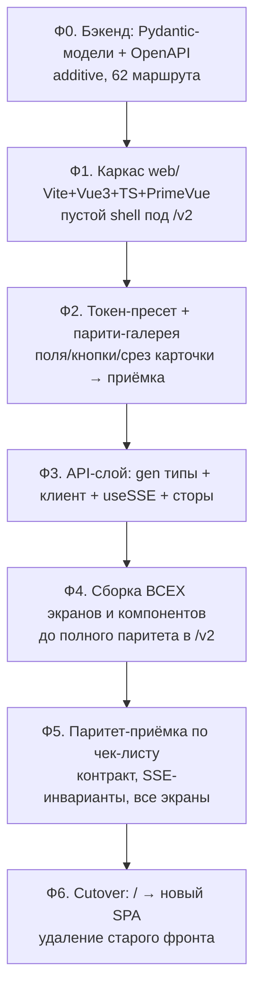

# ТЗ и план: переписывание фронтенда series-tracker

> Статус: **черновик на согласование** (2026-06-17). Документ фиксирует
> цель, стек, констрейнты, карту элементов, план по фазам и правила
> переезда фронтенда на Vite + Vue 3 SFC + TypeScript + PrimeVue.
> Источник нюансов — разведка по коду (app.js, 22 компонента, 14 CSS,
> contracts/*). Связанные документы: [contracts/endpoints.md](../contracts/endpoints.md),
> [contracts/sse_contract.md](../contracts/sse_contract.md), [CLAUDE.md](../CLAUDE.md).

---

## 1. Журнал решений (согласовано с пользователем)

| # | Вопрос | Решение |
|---|---|---|
| Р-Ф1 | Сборка/архитектура | **Vite + Vue 3 SFC + TypeScript** — обязательно |
| Р-Ф2 | UI-библиотека | **PrimeVue 4** (тема — производный пресет под текущие токены) |
| Р-Ф3 | Bootstrap | **Убрать полностью** (и оболочки, и сетку/утилиты) |
| Р-Ф4 | Оболочки (модалки/табы/тосты/таблицы/дерево) | **PrimeVue** (Dialog/Tabs/Toast/DataTable/Tree) — следствие удаления Bootstrap |
| Р-Ф5 | Раскладка/утилиты вместо Bootstrap | **Обычный CSS** (Flexbox/Grid) + токены, как track-muxer |
| Р-Ф6 | Типизация API | **Полная (вариант B):** Pydantic-модели ответов для всех маршрутов + включить OpenAPI + генерация TS-типов |
| Р-Ф7 | Стратегия переезда | **Параллельный `/v2`, полная переделка целиком**, переключение по достижении полного паритета. НЕ инкрементально в прод |
| Р-Ф8 | Точность дизайна | **«Близко»**, приёмка покомпонентно в парити-галерее |
| Р-Ф9 | Кастом-островки | Карточка сериала и конфигуратор правил — **остаются кастомом** на общих токенах |

> **Важно (обратная связь пользователя):** никаких «плавных» переездов
> кусками в прод и срезания углов. Реализация — цельная, читаемая,
> доводится до полного паритета в `/v2`, и только потом переключается.

---

## 2. Цель и не-цели

**Цель.** Убрать «солянку» (CDN-Vue + инлайн-шаблоны-строки + Bootstrap +
слабая компонентизация), переписав фронт на современный собираемый стек
с реальными компонентами, типами и типизированным API-слоем.

**Не-цели (НЕ меняем):**
- **Визуал/UX** — целимся «близко» к текущему виду (приёмка в галерее).
- **Контракт интеграции** — 62 HTTP-маршрута + 11 SSE-событий (см. §8).
- **Поведение бэкенда** — правки только additive (см. §9, §12).
- **Законы series-tracker** — шина/БД/модули не затрагиваются фронтом.

---

## 3. Целевой стек

| Слой | Технология |
|---|---|
| Сборка | **Vite** |
| Фреймворк | **Vue 3**, SFC (`.vue`) + `<script setup>` |
| Язык | **TypeScript** (strict) |
| UI-компоненты | **PrimeVue 4** + primeicons |
| Тема | производный пресет (на базе `Aura`) под токены `variables.css` |
| Раскладка | обычный CSS (Flexbox/Grid) + CSS-переменные (токены) |
| API-клиент | **openapi-fetch** + **openapi-typescript** (типы из `/openapi.json`) |
| SSE | нативный `EventSource` в composable `useSSE` |
| Drag-n-drop | **vuedraggable 4** (для конфигуратора правил) |

---

## 4. Жёсткие констрейнты

1. **Контракт нерушим** — все 62 HTTP-точки и 11 SSE-событий сохраняются
   1:1 (§8). Инварианты: поле `hash` в очередях торрентов (находка 39),
   `is_busy` в каждом `series_updated` (находка 38), `agent_heartbeat`
   не возвращать (удалён, Р-18).
2. **Бэкенд — только additive.** Pydantic-модели описывают **уже
   существующий** JSON; форма ответов не меняется (проверять диффом).
3. **Один источник токенов** — и PrimeVue-пресет, и кастом-островки
   берут цвет/метрики из одного набора переменных.
4. **Дизайн утверждается в парити-галерее** покомпонентно.
5. **Полнота** — ничего не теряется молча: переносятся все экраны и все
   точки контракта; ведётся чек-лист паритета.
6. **`/v2` изолирован** — старый фронт (`templates/`, `static/`) не
   трогаем до полного паритета и переключения.
7. **Дисциплина** — русский; без AI-атрибуции; коммит на каждый
   согласованный шаг.

---

## 5. Карта элементов: тип UI → PrimeVue или кастом

| Тип элемента | Где сейчас | Целевое решение |
|---|---|---|
| Текстовое поле | формы везде | PrimeVue **InputText** |
| Числовое поле | debug, логи | PrimeVue **InputNumber** |
| Пароль | auth | PrimeVue **Password** (toggle-visibility встроен) |
| Select/выпадающий | ConstructorItemSelect | PrimeVue **Select** |
| Checkbox/Switch | настройки, формы | PrimeVue **ToggleSwitch** / **Checkbox** |
| Radio (btn-group) | vk_search_mode | PrimeVue **SelectButton** |
| Кнопка | везде | PrimeVue **Button** |
| Модалка | 6 модалок (Bootstrap) | PrimeVue **Dialog** |
| Табы | status/settings/logs | PrimeVue **Tabs** |
| Аккордеон | конфигуратор правил | PrimeVue **Accordion** |
| Таблица | div-table + Bootstrap table | PrimeVue **DataTable** + **Column** |
| Прогресс-бар | очереди агентов | PrimeVue **ProgressBar** |
| Спиннер | модалки | PrimeVue **ProgressSpinner** |
| Тост | app.js | PrimeVue **Toast** |
| Тултип | точечно | PrimeVue **Tooltip** (директива) |
| Дерево файлов | FileTree | PrimeVue **Tree** |
| Бейджи/пилюли (общие) | статусы, зеркала | PrimeVue **Tag** / **Chip** |
| Drag-n-drop списков | качества, правила | **vuedraggable** (оставляем) |
| **Статус-пилюли карточки** | app.js | **кастом** (часть карточки) |
| **Слои статуса карточки** | card.css | **кастом-островок** (§6) |
| **Конфигуратор правил** | settingsParser | **кастом-островок** (§6) |
| Выбор каталога (DirectoryPicker) | virtual scroll | **открытый вопрос** (§13) |

---

## 6. Кастом-островки (остаются самописными)

Берут цвет/метрики из общих токенов; PrimeVue внутрь не тащим.

1. **Карточка сериала — визуализация статуса.** Многослойная полоса
   (`layer-*`, 11 слоёв c z-index), ширина слоёв по иерархии активных
   статусов (`getLayerStyle`), анимация диагональных полос
   (`move-stripes`, режимы `stripes-normal/slow/stopped` по
   `getAnimationClass`). Аналога в PrimeVue нет. → Vue SFC + scoped CSS
   на токенах. Это «фишка» главного экрана.
2. **Конфигуратор правил.** Профили (аккордеон), правила с приоритетом
   и `continue_after_match`, условия `contains/not_contains`,
   drag-n-drop блоков-паттернов (`vuedraggable`, `contenteditable`).
   Доменный UI без аналога. → Vue SFC; стандартные под-контролы внутри
   (поля, селекты, кнопки) — PrimeVue.

Прочие потенциально-кастомные (решаются при миграции): ChapterManager
(интерактивный фильтр глав), статус-модалка (композиция табов).

---

## 7. Токены: маппинг `variables.css` → пресет PrimeVue

Слой токенов уже есть (`static/css/base/variables.css`, `:root`). План —
сделать **производный пресет PrimeVue** (на базе `Aura`), где семантические
токены берут текущие значения, и **общий слой CSS-переменных** для кастома.

Ориентировочный маппинг (уточняется в Ф2):

| Текущая переменная | Значение | Семантический токен PrimeVue |
|---|---|---|
| `--color-blue` `#0d6efd` | акцент | `primary.color` |
| `--color-gray-100/200` | фоны/бордеры | `surface.*` |
| `--color-text` `#212529` | текст | `text.color` |
| `--color-green-1` `#198754` | успех | `green`/severity success |
| `--color-red-1` `#dc3545` | ошибка | `red`/severity danger |
| `--border-radius` `9px` | радиус | `border.radius` |
| `--border-width` `2px` | толщина | компонентные токены input/button |

Принцип: **один источник правды**. Тема светлая (тёмной нет — вне
объёма). Протёкший хардкод (напр. `rgba(...)` в card.css) при переносе
заменяется на переменные.

---

## 8. Контракт интеграции (сохраняется 1:1)

Полные таблицы — в [contracts/endpoints.md](../contracts/endpoints.md) и
[contracts/sse_contract.md](../contracts/sse_contract.md). Сводно:

- **62 HTTP-маршрута** по группам: серии (CRUD/состояние), сканирование
  и очереди, медиа-элементы и нарезка, композиция/переобработка, auth и
  справочники, конфигуратор правил, TMDB, debug-настройки, служебные
  (`/`, `/api/stream`, логи, БД).
- **11 SSE-событий** (`/api/stream`, keepalive 15с): `series_updated`,
  `series_added`, `series_deleted`, `agent_queue_update`,
  `torrent_progress_update`, `download_queue_update`,
  `slicing_queue_update`, `scanner_status_update`, `renaming_complete`,
  `relocation_started`, `relocation_finished`.
- **Инварианты:** `series_updated` — дельта с обязательным `is_busy`;
  очереди торрентов — с полем `hash`; одно SSE-соединение на приложение.

На фронте контракт оборачивается в:
- сгенерированный типизированный клиент (`src/api/`),
- composable `useSSE` (одна подписка, 11 слушателей → реактивный стор).

---

## 9. Типизация API (вариант B — полностью)

Сейчас OpenAPI **выключен** (`docs_url=None`, нет `response_model`,
маршруты отдают голые `dict`). Поэтому делаем полноценно:

1. **Бэкенд (additive):** для каждого из 62 маршрутов объявить Pydantic
   **модель ответа** (`response_model=...`), описывающую **уже
   существующий** JSON; включить OpenAPI (`openapi_url`, опц. `docs_url`).
   Поведение и форма ответов **не меняются** — проверяется диффом
   ответов до/после на реальных вызовах.
2. **Генерация типов:** `openapi-typescript http://localhost:5000/openapi.json
   -o web/src/api/schema.d.ts` (npm-скрипт `gen:api`).
3. **Клиент:** `openapi-fetch` поверх типов → каждый вызов проверяется
   (путь, параметры, форма ответа).

Это часть «полной переделки» — типобезопасность с первого экрана.

---

## 10. Сборка и раздача (`/v2` → cutover)

```
Сейчас:   GET /            → FileResponse(templates/index.html)
          /static/*        → StaticFiles(static/)

Переезд:  GET /            → старый фронт (без изменений)
          GET /v2          → новый SPA (web/dist/index.html)
          /v2/assets/*     → StaticFiles(web/dist/assets/)
          /api/*           → без изменений (общий бэкенд)

Cutover:  GET /            → новый SPA;  старый templates/static удалён;
          CDN-библиотеки (Vue/Bootstrap/Sortable) убраны.
```

- Новый код — в каталоге **`web/`** (как у track-muxer): `web/src/`,
  `vite.config.ts`, `package.json`, сборка в `web/dist/`.
- FastAPI отдаёт `web/dist` под `/v2` + SPA-fallback; `/api/*` нетронут.
- На cutover — переключение корня и удаление старого фронта одним шагом.

---

## 11. План по фазам



| Фаза | Содержание | Критерий готовности |
|---|---|---|
| **Ф0** | Pydantic-модели ответов на все 62 маршрута, включить OpenAPI | `/openapi.json` валиден; дифф ответов до/после пуст |
| **Ф1** | `web/`: Vite+Vue3+TS+PrimeVue, пустой shell, раздача под `/v2` | `/v2` открывается, сборка отдаётся |
| **Ф2** | Пресет под токены + страница-паритет (InputText, Button, срез карточки) | пользователь утвердил визуал базовых элементов |
| **Ф3** | `gen:api` типы, `openapi-fetch`-клиент, `useSSE` (11 событий), сторы | типы собираются; SSE/HTTP-каркас работает |
| **Ф4** | Главный экран (список+карточка), 6 модалок, вкладки настроек/статуса, кастом-островки | все экраны собраны в `/v2` |
| **Ф5** | Сквозная приёмка vs старый фронт; чек-лист контракта (62+11) | паритет подтверждён |
| **Ф6** | Переключение `/`, удаление `templates/`/`static/`/CDN | прод на новом фронте, старый удалён |

Внутри Ф4 — порядок областей: вкладки настроек → модалки (Logs,
Confirmation, DatabaseViewer, Add, Status) → главный экран + карточка
(кастом) → конфигуратор правил (кастом). Карточка и конфигуратор — в
конце, как самые кастомные.

---

## 12. Правила (законы переезда)

1. **Контракт нерушим** — 62 HTTP + 11 SSE; инварианты `hash`/`is_busy`;
   `agent_heartbeat` не воскрешать.
2. **Бэкенд только additive** — Pydantic-модели не меняют JSON; каждая
   правка проверяется диффом ответа до/после.
3. **Один источник токенов** — PrimeVue-пресет и кастом из одних
   переменных; новых параллельных палитр не заводить.
4. **Кастом — только без аналога** (~80% правило): сейчас это карточка
   и конфигуратор правил; всё остальное — PrimeVue.
5. **Дизайн — приёмка в галерее** покомпонентно («близко», не пиксель).
6. **Полнота, без срезания углов** — цельная читаемая реализация;
   заглушки/«пока попроще» запрещены как дефолт; ничего не теряется
   молча; ведётся чек-лист паритета.
7. **`/v2` изолирован** — старый фронт не трогаем до cutover.
8. **TypeScript strict**; **русский**; **без AI-атрибуции**; **коммит на
   каждый согласованный шаг**.

---

## 13. Открытые мелкие вопросы (решаются по ходу, не блокеры)

1. **DirectoryPicker** (выбор каталога, virtual scroll, кеш, recent):
   перевести на PrimeVue **Tree**/**Listbox** или оставить кастом с
   виртуализацией? — решить в Ф4 при миграции.
2. **ChapterManager** (интерактивный фильтр глав): чистый PrimeVue или
   кастом? — решить при миграции вкладки нарезки.
3. **Имена SSE/HTTP** на фронте: переиспользуем `contracts/*` как
   единый список для чек-листа паритета.
4. **i18n / тёмная тема** — вне объёма (приложение русскоязычное,
   тема светлая).
